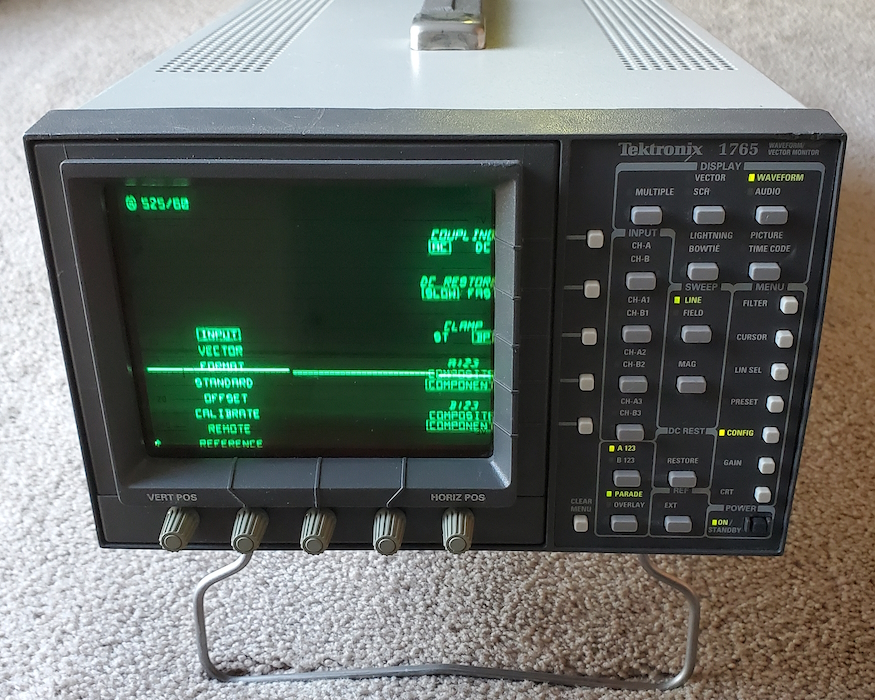
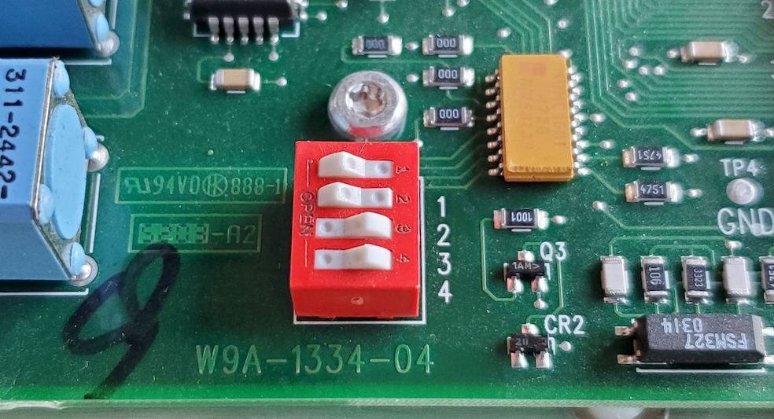
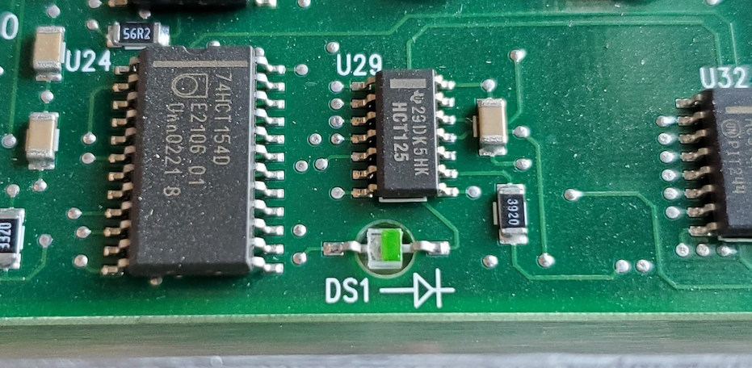
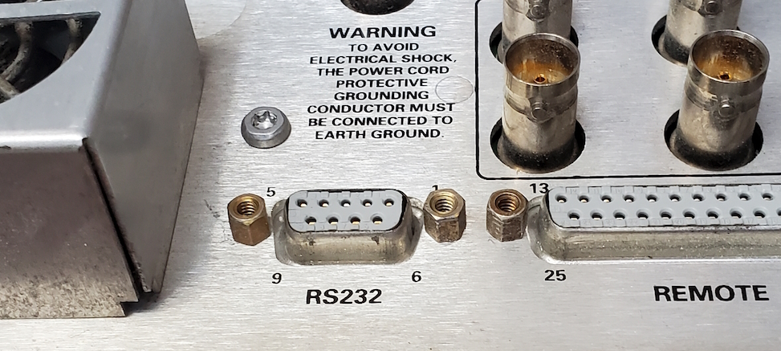

# Deep Documentation of the Tektronix 1740A, 1750A, and 1760 Families of Vectorscopes

# Overview 

Tektronix released a family of vectorscopes / waveform monitors for analyzing NTSC and/or PAL analog television signals.  This document covers several features of these vectorscopes, many not covered in the official user manual, service manual, or softwware.  These include:

- Accessing the Boot menu and how to use it to access internals of the device
- Connecting to the RS-232 port and its settings
- Purpose of the DIP switches and jumper
- Understanding the blink codes by internal diagnostic LED
- Boot mode vs Application mode abilities and commands
- How the released DOS programs work for settings backup (NVSAVE.EXE), settings restore (NVRESTOR.EXE), and firmware upgrades (UPGRADE.EXE)

The specific Tektronix models covered are:

- 1740A, 1741A, 1745A
- 1750A, 1751A, 1755A
- 1760, 1761, 1765



Links to the official user manuals, service manuals, and software is provided in the References section towards the end.

In addition to this document, example data files are included that are produced or consumed by the official Tektronix software.

This document is based on v1.05 of the Boot ROM and v2.4 of the Application ROMs.

# Modes of Operation

These vectorscopes have 2 modes of operation.  They are **Boot mode** and **Application mode**.  When the device is turned on, it first enters Boot mode.  Here the device initializes the hardware, might enter the interactive Boot Menu depending on circumstances, and then switches to Application mode.  While in Boot mode, the screen is off and the front panel buttons and lights are not active.  After switching to Application mode, full vectorscope functionality is available, including active display, front panel buttons, and front panel lights.

When the metal cover has been removed, the chips that store the Boot mode code and Application mode code are visible on the bottom circuit board.  The Boot mode code is stored in 1 EEPROM chip labeled as U13.  The Application mode code is stored in 2 FLASH ROM chips labeled as U10 and U16.

# Jumpers

To enable access to the Boot Menu, the following needs to be done.  Some of this is covered in the Service Manual.

1.  Turn off the device
2.  Remove the metal cover (remove 2 back screws and slide it off).
3.  Locate the red and white DIP switch package called S1.  It on the bottom circuit board near the front of the device.
4.  To enable access to the Boot Menu, set switch 4 in the DIP switch package to OPEN.  Press the switch down on the side labeled as "open".
5.  (optional) To enable extra LED diagnostic blink patterns, set switch 3 in the DIP switch package to OPEN.
6.  (optional) To enable writing to the FLASH ROM chips, where the code for Application mode is stored, locate jumper J4 near the large tall black rectangular Dallas chip.  Move the jumper to short the 2 pins *closest* to the Dallas chip U14.  Doing the also allows software to query the FLASH ROM chips for their make and model, which is needed to be able to write to the FLASH ROM chips.  If the firmware is not being updated, it is safest to *not* moving the jumper and instead to leave the jumper shorting the 2 pins *furthest* from the Dallas chip.

Summary:

- Switch 4 on S1 set to OPEN to enable access to the Boot Menu
- Switch 3 on S1 set to OPEN to enable extra Diagnostic LED blink patterns.
- Jumper J4 with the 2 pins closest to Dallas chip shorted to enable FLASH ROM chip identification and upgrading.



# Diagnostic LED

There is a Diagnostic LED on the bottom circuit board labeled as DS1 located near the edge that is opposite the large Dallas chip.  Some blink patterns only occur if certain DIP switches are set on DIP switch package S1 (noted in parenthesis below), others patterns always occur.  The typical boot patterns that occur after turning the device on are, in order:

1.  1 fast blink indicates initialization of memory map and other on-chip MCU registers completed.
2.  1 fast blink indicates Boot ROM chip (U13) passed the checksum verification
3.  2 fast blinks indicates data bus and address bus enabled for buffered memory mapped devices.
4.  3 fast blinks indicates that SRAM's simple pattern test passed
5.  4 slow blinks indicates the SPI bus successfully read the DIP switch settings (only if switch 3 is OPEN)
6.  5 slow blinks indicates the Application mode's code in both of FLASH ROM chips passed the checksum verification (only if switch 4 is CLOSED and switch 3 is OPEN)
7.  There is a pause as Application mode is started
8.  ~1 second of the LED being dim.  It is actually flickering faster than the eye can detect.
9.  The LED becomes brighter.  It is still flickering faster than the eye can detect, but is spending more of its time active.

Note that if the device reboots due to an exception, crash, or a reboot was request requested via Control+X in the terminal program, then several of the steps above are skipped.

The fast flickering of the LED during Application mode is suspected to indicate activity, such as ISR activity, idle activity, or switching between tasks.  This is only a guess at this time.



LED Failure Codes:

- Repeating loop of 1 fast blink indicates Boot ROM chip (U13) failed the checksum verification
- Repeating loop of 3 fast blinks indicates that SRAM's simple pattern test failed
- Repeating loop of 4 slow blinks followed by 1 slow blink means the SPI bus failed for MAIN1_CS
- Repeating loop of 4 slow blinks followed by 2 slow blinks means the SPI bus failed for MAIN2_CS
- Repeating loop of 4 slow blinks followed by 3 slow blinks means the SPI bus failed for MAIN1_EN
- Repeating loop of 5 slow blinks means the FLASH ROM with the even bytes (chip U16) failed the checksum verification (only if switch 4 is CLOSED)
- Repeating loop of 6 slow blinks means the FLASH ROM with the odd bytes (chip U10) failed the checksum verification (only if switch 4 is CLOSED)

# RS-232 Serial Communication

To communicate with these vectorscopes, use the 9-pin RS-232 connector on the back.  The serial settings are 9600 baud, no parity, 8 bit, 1 stop bit, software flow control (aka XON/XOFF flow control), no local echo, no auto appending carriage return or linefeed bytes when one or the other are sent by the terminal program.



Most terminal software is compatible.  Examples include as Putty for Windows, Serial2 for the Mac, and any of a number of terminal programs available for Linux.

In both Boot mode and Application mode, serial communication is available with the above settings.  However, what is communicated is different and described later.

In addition to normal terminal software, Tektronix provided multiple DOS utilities on 2 floppy disks.  The ones that communicate over serial are: NVSAVE.EXE, NVRESTOR.EXE, UPGRADE.EXE, CAL.EXE, and NEW_CAL.EXE.  CONVERT.EXE does not communicate over serial.  User operation of these programs is covered in the Service Manual.  Using these programs in modern OSes requires an emulator or virtual machine.  For example, these DOS utilities can be executed in DosBox on Windows with a USB-to-serial adapter assigned to DosBox via a DosBox configuration file.  The first time the DOS utilities are run, the execution cycles need to be set low to initialize the serial port properly (example: 40 to 100 on one user's machine).  However, NVSAVE.EXE will miss transmitted bytes and produce incomplete files with the execution cycles set low, so it needs to be run a 2nd time after the execution cycles are increased (example: 1000 to 4000 on one user's machine).

# Boot Menu

Boot mode and Application mode operate differently.  Boot mode and its associated Boot Menu will be discussed in detail first.

## Accessing the Boot Menu

To access the boot menu:

1.  Follow the instructions in the Jumpers section above.
2.  Connect a serial cable to the device's RS-232 port.
3.  Launch a terminal program on a computer and use the settings in the RS-232 Serial Communication section.
4.  Turn the device on
5.  Press any key in the terminal program when instructed by the device before the countdown reaches zero (see notes)
6.  Boot Menu has been entered.

Example output:

```
Tektronix 1700 Series System Boot
Boot Version 1.05

Copyright (c), 1991-1993  Tektronix, Inc.  All Rights Reserved.
Copyright 1984-1991  Wind River Systems, Inc.


Press any key to stop auto-boot...
 5
[Boot]:
```

Note: when pressing "any key" there are 2 special keys:

- If '@' is pressed, then the countdown is aborted and the device immediately switches to Application mode.
- If '!' is pressed, then the Boot Menu is still entered but `Unrecognized command. Type '?' for help.` is printed first.  This appears to be an unimplemented or removed command.

## Control Characters In Boot Mode

There are a handful of control characters that are supported at the Boot Menu.  '^H' is short-hand to mean the Control and H keys were pressed at the same time.  The byte produced by pressing Control and an key are listed in hex.

| Chars | Byte | Meaning                                       |
|-------|------|-----------------------------------------------|
| ^H    | 0x08 | Backspace                                     |
| ^U    | 0x15 | Delete entire line                            |
| ^J    | 0x0a | Linefeed                                      |
| ^M    | 0x0d | Carriage Return                               |
| ^S    | 0x13 | Flow Control (device stops transmitting)      |
| ^Q    | 0x11 | Flow Control (device resumes transmitting)    |
| ^X    | 0x18 | Reboot                                        |

## Commands

The Boot Menu supports commands that perform low-level operations such as read and writing memory, programming the FLASH ROMs, and etc.

Format:

- All commands are a single character.
- Upper-case commands always print "PASS" or "ERROR: ..." when they complete.  All other commands do not print these.
- Upper-case commands also are *not* listed by the help commands 'h' and '?'.  All other commands are listed by the help commands.
- If there are parameters, they are almost always numbers.  Some numbers are treated as decimal numbers unless they are preceeded by a '$' or '0x' to indicate they are hexadecimal.  Other numerical parameters are always hexadecimal and these will be noted with a '_h' suffix below.  The few parameters that are strings will be noted with a '_s' suffix below.
- Spaces between parameters are optional but a ',' is required.
- Optional parameters are noted inside of square brackets.
- Bytes are 8 bits in size and words are 16 bits.

Thus, the following command examples are equivalent:

- `d 80000, 16`
- `d80000,16`
- `d 80000, $10`
- `d 80000, 0x10`

Summary table:

| Cmd | Parameters                          | Description                                                                       |
|-----|-------------------------------------|-----------------------------------------------------------------------------------|
| ?   |                                     | Help message is printed about some commands.                                      |
| h   |                                     | Identical to '?' command.                                                         |
| @   |                                     | Exit the Boot Menu, begin Application mode.  Execution starts at 0x00100000.      |
| d   | [address_h, [nWords]]               | Display memory contents starting at address_h for the specified number of words.  |
| f   | address_h, nBytes, fillVal          | Fill memory starting at address_h with nBytes count of the value fillVal.         |
| m   | address_h                           | Modify memory interactively starting at address_h.                                |
| t   | srcAddr_h, dstAddr_h, nBytes        | Transfer (copy) nBytes of data from srdAddr_h to dstAddr_h.                       |
| e   |                                     | Exception that was fatal is printed.                                              |
| g   | address_h                           | Go to address_h and start executing.                                              |
| b   | srcAddr_h, dstAddr_h                | Burn FLASH with data at srcAddr_h.  dstAddr_h is limited (requires J4 jumper).    |
| V   |                                     | Version of Boot mode code is displayed.                                           |
| M   |                                     | Memory size in bytes of the largest available free block of RAM.                  |
| S   | option_s                            | Set terminal mode where option_s is "noecho" or "term" to disable or enable echo. |
| C   | address_h, nChecksums_h, [nBytes_h] | Checksum check FLASH or Boot ROM (J4 jumper required if nBytes omitted or zero).  |
| I   | address_h                           | Identify type of FLASH ROM chip located at address_h (requires J4 jumper).        |
| E   | address_h                           | Erase the FLASH ROM chips located at address_h (requires J4 jumper).              |
| P   | address_h, offset_h, nBytes_h       | Program FLASH ROM chip with nBytes_h of transmitted data (requires J4 jumper).    |

### Help Command

Prints help text that summarizes non-upper-case commands.  Upper-case commands are not listed.

**Synopsis**

```
?
h
```
**Examples**

```
[Boot]: ?

 ?                     - print this list
 @                     - boot (load and go)
 g adrs                - go to adrs
 d adrs[,n]            - display memory
 m adrs                - modify memory
 f adrs, nbytes, value - fill memory
 t adrs, adrs, nbytes  - copy memory
 b from, to            - burn (program) Flash
 e                     - print fatal exception
```

### Exit Boot Menu Command

Exits the Boot Menu and begins Application mode.  Execution starts at 0x00100000.

**Synopsis**

`@`

**Examples**

```
[Boot]: @
Starting at 0x100000...
```

### Display Memory Command

Display memory contents as 16-bit words and as ASCII.

**Synopsis**

`d [address_h, [nWords]]`

**Description**

*address_h* is the starting address of the memory to display, always in hexadecimal.  If it is 0 or omitted, then the displayed memory will continue from where the previous display left off to ease displaying the next region of memory.  Since bit 0 of address_h is ignored, set address_h to 1 in order to display the memory at 0x00000000.  Note that the built-in help command incorrectly lists address_h as a required parameter.

*nWords* is the number of 16-bit words to display.  If it is 0 or omitted, then the value from the previous 'd' command's nWords is used.

**Examples**

```
[Boot]: d 7000, 64
007000:  0041 0042 0043 0044  0045 0046 0047 0048   *.A.B.C.D.E.F.G.H*
007010:  0049 004a 004b 004c  004d 004e 004f 0050   *.I.J.K.L.M.N.O.P*
007020:  0051 0052 0053 0054  0055 0056 0057 0058   *.Q.R.S.T.U.V.W.X*
007030:  0059 005a 005b 005c  005d 005e 005f 0060   *.Y.Z.[.\.].^._.`*
007040:  0061 0062 0063 0064  0065 0066 0067 0068   *.a.b.c.d.e.f.g.h*
007050:  0069 006a 006b 006c  006d 006e 006f 0070   *.i.j.k.l.m.n.o.p*
007060:  0071 0072 0073 0074  0075 0076 0077 0078   *.q.r.s.t.u.v.w.x*
007070:  0079 007a 007b 007c  007d 007e 007f 0021   *.y.z.{.|.}.~...!*
[Boot]: d
007080:  0022 0023 0024 0025  0026 0027 0028 0029   *.".#.$.%.&.'.(.)*
007090:  002a 002b 002c 002d  002e 002f 0030 0031   *.*.+.,.-.../.0.1*
0070a0:  0032 0033 0034 0035  0036 0037 0038 0039   *.2.3.4.5.6.7.8.9*
0070b0:  003a 003b 003c 003d  003e 003f 0040 0000   *.:.;.<.=.>.?.@..*
0070c0:  0000 0000 0000 0000  0000 0000 0000 0000   *................*
0070d0:  0000 0000 0000 0000  0000 0000 0000 0000   *................*
0070e0:  0000 0000 0000 0000  0000 0000 0000 0000   *................*
0070f0:  0000 0000 0000 0000  0000 0000 0000 0000   *................*
```

### Fill Memory Command

Fill a memory range with a specific value.

**Synopsis**

`f address_h, nBytes, fillVal`

**Description**

*address_h* is the starting address of the memory to fill, always in hexadecimal.

*nBytes* is the number of bytes to write, starting at location address_h and ending at location address_h + nBytes - 1.  This value can be up to 32-bits in size.

*fillVal* is the value to write at each byte location.  It's value ranges from 0 - 255, or 0x00 - 0xff in hexadecimal.

**Examples**

```
[Boot]: f 7000, 16, 0x41
[Boot]:
[Boot]: d 7000, 16
007000:  4141 4141 4141 4141  4141 4141 4141 4141   *AAAAAAAAAAAAAAAA*
007010:  0000 0000 0000 0000  0000 0000 0000 0000   *................*
```

### Modify Memory Command

Interactively modify the contents of memory.  Starting at the specified starting memory address, it will display the current 16-bit value read from that location.  If a hexadecimal number is typed in and Enter is pressed, then that value will be written to that location and it will repeat this process at the next address.  If nothing is typed in and Enter is pressed, then the memory location is not altered and the process will repeat at the next address.  To stop modifying memory, press ^D.  The process also stops if invalid characters are typed in and Enter is pressed.

**Synopsis**

`m address_h`

**Description**

*address_h* is the starting address of the memory to modify.

**Examples**

```
[Boot]: m 7000
007000:  0065-41
007002:  0066-42
007004:  0067-43
007006:  0068-44
007008:  0069-45
00700a:  0070-46
00700c:  0071-47
00700e:  0072-48
007010:  0073-49
007012:  0074-4a
007014:  0075-^D
[Boot]:
[Boot]: d 7000, 10
007000:  0041 0042 0043 0044  0045 0046 0047 0048   *.A.B.C.D.E.F.G.H*
007010:  0049 004a                                  *.I.J            *
```

### Transfer Memory Command

Transfer (copy) nBytes of data from srdAddr_h to dstAddr_h.

**Synopsis**

`t srcAddr_h, dstAddr_h, nBytes`

**Description**

*srcAddr_h* is the starting address of the memory to copy from.

*dstAddr_h* is the starting address of the memory to copy to.

*nBytes* is the number of bytes to copy.

**Examples**

```
[Boot]: t 7000, 7010, 16
[Boot]:
[Boot]: d 7000, 16
007000:  0041 0042 0043 0044  0045 0046 0047 0048   *.A.B.C.D.E.F.G.H*
007010:  0041 0042 0043 0044  0045 0046 0047 0048   *.A.B.C.D.E.F.G.H*
```

### Exception Printing Command

Prints the last known fatal exception to have occurred.  The last known fatal exception is stored in NVRAM, starting at address 0x301f01.  Exceptions that occur in Boot mode are not stored so it is presumed that exceptions in Application mode are stored.  This command will print the exception as a string up until the first non-whitespace control character occurs.

**Synopsis**

`e`

**Examples**

```
[Boot]: e

V0
```

### Go to Address and Execute Command

Start executing the code at the specified address.

**Synopsis**

`g address_h`

**Description**

*address_h* is the starting address of the memory to execute.

**Examples**

In the below example, address 0x80010 is the entry point for the fast reboot, which has a 1 second countdown.  The slow reboot that occurs for power-up or when ^X is pressed, which has a 7 second countdown, is at address 0x80008.

```
[Boot]: g 0x80010
Starting at 0x80010...

Tektronix 1700 Series System Boot
Boot Version 1.05

Copyright (c), 1991-1993  Tektronix, Inc.  All Rights Reserved.
Copyright 1984-1991  Wind River Systems, Inc.


Press any key to stop auto-boot...
 0
auto-booting...

Starting at 0x100000...
```

### Burn FLASH Chips Command

This command is intended to copy data from the source address to the destination address, the latter must be in an address range with FLASH chips.  The FLASH chips at the destination address are erased before writing begins.  The size of the data copied is fixed to the number of words that 2 FLASH chips in parallel can store since 2 8-bit wide FLASH chips are used to support the 16-bit data bus.  Thus, since 28F010 and 28F020 FLASH chips are supported, the size will be determined at run-time based off of the FLASH chips at the destination address.  Thus, the size and will be either 128K words or 256K words, respectively (256KB or 512KB, respectively).  The destination address is restricted to the values of 00100000, 00140000, 00c00000, and 00c40000.  The values 00140000 and 00c40000 should only be used if 00100000 and 00c00000 were reported as 28F010 only.  The ROMs at 00100000 and 001400000 are populated on the board while 00c00000 and 00c40000 are not.

The J4 jumper must be set to enable writes to the FLASH chips.

Because the amount of data copied is 1x or 2x the size of the onboard SRAM, the usefulness of this command is limited.

**Synopsis**

`b srcAddr_h, dstAddr_h`

**Description**

*srcAddr_h* is the starting address of the memory to copy from.

*dstAddr_h* is the starting address of the memory to burn to.  This value is restricted to the ranges of 00100000-0017ffff or 00c00000-00c7ffff.  It is theorized that dstAddr_h is intended to only be the values 0010000 or 00c00000 (for either 28F010 or 28F020 FLASH chips) or 00140000 or 00c40000 (for 28F010 only).

**Examples**

Output when J4 disables writes to FLASH.

```
[Boot]: b 0, 100000
Unable to determine flash type at address 100000
```

Theoretical output when J4 enables writes to FLASH.

```
[Boot]: b c00000, 100000
Erasing 28F020
Programming 28F020
Programming complete, remove 12V jumper
```

### Version Command

Prints the version of the code stored in the Boot ROM.

**Synopsis**

`V`

**Examples**

```
[Boot]: V
Boot Version 1.05
PASS
```

### Memory Available Command

Prints the size of the largest contiguous block of free memory in SRAM.

Locating the start address of the free block is more complicated.  It involves walking a doubly-linked list.  The steps are:

1. Inspect the 32-bit contents of address 0x0000525c.  These contents point to the 1st element of a linked list.  An element consists of three 32-bit values followed by a variable length of bytes.  The 1st value is the size of the block in bytes, the 2nd is a pointer to the next element in the list, and the 3rd is a pointer to the previous element in the list.  However, all pointers point to the 2nd value in the element.  In other words, a pointer points to uint32[0] which is the pointer to the next element while the block size is uint32[-1].
2. Walk the entire list to find the largest block size.  The list is terminated when uint32[0] is NULL.
3. The largest element has the following values:
    1. uint32[-1] is the size of the entire free block.  To get the number of writable bytes, compute ((uint32[-1] & 0xfffffffe) - 8).  This will match the value reported by the M command.
    2. &(uint32[2]) is the address of the 1st writable byte of the block.
    
```
struct element {
    uint32  sizeInBytes;
    void*   nextElement;    // Points to next element's nextElement
    void*   prevElement;    // Points to previous element's nextElement
    byte    writableData[]; // Length is ((sizeInBytes & 0xfffffffe) - 8)
};
```

**Synopsis**

`M`

**Examples**

```
[Boot]: M
207196
PASS
```

### Set Terminal Mode Command

Sets whether the device echoes received bytes (user can see what they are typing) or not (user does not see what they are typing).  

**Synopsis**

`S option_s`

**Description**

*option_s* can be "noecho" to disable echo or "term" to enable it.

**Examples**

```
[Boot]: S term
PASS
[Boot]: S noecho
PASS
```

### Checksum Check Command

Checks whether the computed checksum(s) matches the checksum(s) stored in the FLASH ROMs or Boot ROM.  It also works for any generic memory location that ends with 1 or more checksum values.

The checksum is a 1 or more 16-bit values located at the end of the memory being checked.  The algorithm for how it is computed is described in detail later.  The Boot ROM is an 8-bit wide chip so 1 checksum value is used.  FLASH is organized to be 16-bits wide, which requires 2 8-bit wide chips, which is why there are 2 checksum values used (one for checking the even bytes, the other for checking the odd bytes).

If the nBytes_h parameter is omitted while checking FLASH, then the J4 jumper must be set to enable writes to the FLASH chips for the command to succeed.

**Synopsis**

`C address_h, nChecksums_h, [nBytes_h]`

**Description**

*address_h* is the starting address of where to compute the checksum.

*nChecksums_h* is the number of checksums contained within but located at the end of the memory range being checked.  When checking the Boot ROM, this value should be 1.  When checking the FLASH ROMs, this value should be 2.

*nBytes_h* is the number of bytes to check.  This value includes both the data bytes and the checksum bytes.  This value is required when checking the Boot ROM and should be the value 20000 in this case.  This value is optional for FLASH ROMs, but if included should be 80000 for 28F020 chips and 40000 for 28F010 chips.  If omitted for FLASH, then J4 must be set to enable writes to FLASH so the chip sizes can be automatically queried.  For generic memory, this value is required.

**Examples**

Output for checking the checksums for the Boot ROM, 28F020 FLASH ROMs with nBytes_h included, and 28F020 FLASH ROMs with nBytes_h omitted.  The last one requires J4 to enable writes to FLASH:

```
[Boot]: C 80000,1,20000
PASS
[Boot]: C 100000,2,80000
PASS
[Boot]: C 100000,2
PASS
```

Output for checking the checksums for 28F020 FLASH ROMs with nBytes_h omitted but J4 disables writes to FLASH:

```
[Boot]: C 100000,2
ERROR: Unable to determine part size
```

### Identify FLASH Chips Command

Identify the type of FLASH ROM chip located at the specified address.  Successful responses will report 28F010 or 28F020.

The J4 jumper must be set to enable writes to the FLASH chips for the command to succeed.

**Synopsis**

`I address_h`

**Description**

*address_h* is the address of the FLASH chip to identify the type of chip.  This value is restricted to values of 00100000, 00140000, 00c00000, 00c40000, even though the latter two are not populated on the board.  Also, 00140000 and 00c40000 should only be used if 00100000 or 00c00000 are reported as 28F010, respectively.

**Examples**

Output when J4 enables writes to FLASH.

```
[Boot]: I 00100000
28F020
PASS
```

Output when J4 disables writes to FLASH.

```
[Boot]: I 00100000
ERROR: Unrecognized flash part type
```

### Erase FLASH Chips Command

Erase the FLASH ROM chip located at the specified address.  The Diagnostic LED will operate during the erasing process.

The J4 jumper must be set to enable writes to the FLASH chips for the command to succeed.

**Synopsis**

`E address_h`

**Description**

*address_h* is the address of the FLASH chip to erase.  This value is restricted to values of 00100000, 00140000, 00c00000, 00c40000, even though the latter two are not populated on the board.  Also, 00140000 and 00c40000 should only be used if 00100000 or 00c00000 are reported as 28F010, respectively.

**Examples**

Output when J4 enables writes to FLASH.

```
[Boot]: E 00100000
PASS
```

Output when J4 disables writes to FLASH.

```
[Boot]: E 100000
ERROR: Unable to determine flash part size
```

### Program FLASH Chips Command

Program the FLASH ROM chips located at the specified address with the transmitted bytes that follow the command.  The number of bytes can be any size from 1 word to max allocatable size in SRAM.  Since the M command reports the number of bytes, it is necessary to divide by 2 to get the number of words.

After this command is issued, it is immediately followed by the bytes to be programmed and then by a 16-bit checksum and finally by a single byte that is a carriage return or linefeed.  The checksum is the same one used by the Boot ROM and FLASH ROMs that is detailed later in this document.  Both the data and checksum are escaped prior to being transmitted.  Transmissions are performed in binary.  The transmitted bytes are as follows:

- If the original byte is in the range of 0x20 - 0xff, then the transmitted byte has the same binary value.
- If the original byte is in the range of 0x01 - 0x1f, then 0x1b is transmitted first followed by 0x20 added to the original byte.  For example: 0x03 is transmitted as 0x1b 0x23
- If the original byte is 0x00, then it can be transmitted as either format.  In other words, it can be transmitted as 0x00 or as 0x1b 0x20.

Because of the above, the command should be issued with a single carriage-return byte or a linefeed byte but not both.  If the terminal transmits both carriage-return and linefeed bytes, the 2nd character will be treated as part of the bytes to be programmed into the FLASH ROMs.

The Diagnostic LED will operate during the programming process.  It flashes too fast for the blinks to be see by the human eye.  With high-speed equipment, it is observed to blink 5 times before each word write and 4 times after each word write.

It is recommended that the I command be run once beforehand to determine if the FLASH ROM chips are 28F010 chips.  If they are 28F010 chips, the P command will fail if its data straddles the memory 00140000 or 00c40000.  In this case, split the P command into 2 P commands, one with the data from below and up to 0013ffff or 00c3ffff and the other for data starting at 00140000 or 00c40000 and higher.  If the FLASH ROM chips are 28F020, this is not necessary.

It may be preferrable to issue `S noecho` before the P command so that the transmitted data is not echoed back to the terminal program.

The J4 jumper must be set to enable writes to the FLASH chips for the command to succeed.

**Synopsis**

`P address_h, offset_h, nBytes_h`

**Description**

*address_h* is the starting address of the FLASH chip to be programmed, not the address that the data is written to (see offset_h).  This value is restricted to values of 00100000, 00140000, 00c00000, 00c40000, even though the latter two are not populated on the board.  Also, 00140000 and 00c40000 should only be used if 00100000 or 00c00000 are reported as 28F010, respectively.

*offset_h* is the offset number of bytes from address_h for where data will be written to in the FLASH chips.  Thus, programming will start at the address of address_h + offset_h.

*nBytes_h* is the number of bytes to be programmed into the FLASH ROM chips.  This number should be an even number.  The value is the number of bytes prior to transmission escaping being applied.  The value also does not include the neither the raw nor escaped 16-bit checksum.

**Examples**

Output when J4 enables writes to FLASH, echo is left on, and checksum is valid.

```
[Boot]: P 100000,0,e
Hello, World !S}
PASS
```

Output when J4 enables writes to FLASH, echo is left on, and checksum is invalid.

```
[Boot]: P 100000,0,e
Hello, World !xx
ERROR: Data corrupted in transmission
```

Output when J4 disables writes to FLASH, echo is left on, and checksum is valid.

```
[Boot]: P 100000,0,e
Hello, World !S}
ERROR: Flash burn failure at location 100000  Data: 4865  Lower Byte Error
```

## Command Examples for Common Tasks

Below are examples for some common tasks that can be accomplished with the Boot menu.  Note that some of the commands can take a while to execute due to the large amount of data being transferred at 9600 baud.

Reboot the device, whether in Boot mode or Application mode by pressing ^H (i.e., CONTROL+H).  This can be used to enter or re-enter Boot mode (assuming the switches are set correctly) as well as abort a long executing command.

Display the entire contents of the Boot ROM (128KB):

`d 80000, 0x10000`

Display the entire contents of the Application ROM (512KB):

`d 100000, 0x40000`

Display the entire contents of the SRAM (256KB), note the use of the '1' here:

`d 1, 0x20000`

Display the entire raw contents of the NVRAM (8KB):

`d 300000, 0x1000`

Display the current values stored in most of the CPU's built-in peripheral registers (128B, 1KB):

```
d fffa00, 0x40
d fffc00, 0x200
```

The following displays have some restrictions for accessing memory.  Displaying the memory ranges starting at fffb00 and ffe000 is only possible after a cold boot or if Application mode has not been entered since a cold boot.  This is because there is a write-once bit in the TPUMCR register (fffe00) that disables access to the TPURAM Control Registers (fffb00 range) and the TPURAM itself (ffe000 range).

Display the current values stored in the remaining CPU's built-in peripherals, the TPURAM Control Registers and the TPURAM itself (64B, 2KB):

```
d fffb00, 0x20
d ffe000, 0x400
```

In addition to displaying the contents of memory, it is possible to upload a large amount of data into SRAM or NVRAM.  This can be achieved by pasting 16-bit hexadecimal number, one number per line, into a terminal after executing the `m` command.  This assumes that correct settings have been correctly set as specified in the **RS-232 Serial Communication** section.  For example, the following 16-bit...

```
0001
0203
0405
0607
0809
0a0b
0c0d
0e0f
```

... can uploaded into SRAM by being pasted in the to terminal after executing `m 10000`, followed by a ^D.  During the pasting operation, the text display in the terminal may appear garbled.  Output from this example, followed by the `d` display command, is similar to:

```
[Boot]: m 10000
010000:  0001-0001
0203
0010002:  4002035-
06070
100040:  800405-9
0a0b010006:  00c6070-d
0e00f10008:  0809-01000a:  0a0b-01000c:  0c0d-01000e:  0e0f-010010:  0000-^D
[Boot]: d 10000, 0x10
010000:  0001 0203 0405 0607  0809 0a0b 0c0d 0e0f   *................*
010010:  0000 0000 0000 0000  0000 0000 0000 0000   *................*
[Boot]:
```

# Application Mode

After Boot Mode has finished, the device switches to Application mode.  This mode provides full vectorscope functionality, including active display, front panel buttons, and front panel lights.

While in Application Mode, the RS-232 serial port can still be accessed with terminal software using the same settings listed in the "RS-232 Serial Communication" section above.

The functionality and commands are completely different from the Boot Menu.  Some of the differences are that there is no prompt displayed (e.g., nothing similar to `[Boot]:`), improper commands and typos do not cause an error to be displayed (i.e. failures are silent), and there does not appear to be any built-in help command.  It's main purpose is for retrieving or setting values.  Values are kept in the calibration configuration, the active configuration, and the preset configurations.  Values can be *directly* accessed for the calibration configuration and the active configuration.  However, values in preset configurations can not be directly accessed.  Instead, a preset configurations must be loaded (or saved) as the active configuration, where the values can then be accessed.  There are multiple preset configurations that user can control via the front panel and one factory preset that the user can not control.

What can be performed in Application Mode is:

- Get or set a single value at a time.  A value either comes from the active configuration or from the calibration configuration.
- Read all calibration values at once.
- Read all values from the active configuration at once. 
- Copy the active configuration to a preset.  A preset can be a user controlled preset.
- Load a user or the factory preset as the active configuration.

At this time, it is unknown if any jumpers have an effect on this mode.

The protocol is based off of IEEE 488.2 and SCPI (Standard Commands for Programmable Instruments).  There are numerous resources that describe SCPI, such as at [Wikipedia's SCPI article](https://en.wikipedia.org/wiki/Standard_Commands_for_Programmable_Instruments).  In brief, commands can be used to set and/or get values.  Examples:

- Setting a value: `:CALSIGNAL:ENABLE OFF`
- Getting a value: `:CALSIGNAL:ENABLE?` returns `:CALSIGNAL:ENABLE OFF`
- Getting multiple values: `:CALSIGNAL?` returns `:CALSIGNAL:ENABLE OFF;WAVE SQWAVE`

The header (the `:CALSIGNAL:ENABLE` portion) is *which* value is to be set or retrieved and has a path-like format.  The headers are case-insensitive and excessive whitespace is ignored.  When setting a value, this is followed by a space and then the value (e.g., the `OFF` portion).  Retrieving a single value only requires using the same header but adding a `?` at the end, with the response having the same format used by the set command.  Multiple values can be retrieved by using fewer path segments with a `?` (e.g., `:CALSIGNAL?`).  It's response is multiple headers and values separated by the `;` character and if multiple sequencial headers have the same starting path then the identical portions of the path may be omitted (e.g., the `WAVE SQWAVE` is short for `:CALSIGNAL:WAVE SQWAVE`).  Multiple values can be set in a similar manner using the `;` to seperate the commands.  Additionally, path segments don't need to be fully typed output in a command or returned in a response.  For example: both `:CALSIGNAL?` and `:CALS?` are equivalent.  It is common to document SCPI commands with the required letters a capital letters and the option letters in lower cases (e.g., `:CALSignal:ENable?`).  Responses can have the headers in long form, short form, or event omitted leaving only bare values.  These are controlled using the `VERBOSE` and `HEADER` commands.  For example:

- `VERBOSE ON;  HEADER ON;  CALS?` returns `:CALSIGNAL:ENABLE OFF;WAVE SQWAVE`
- `VERBOSE OFF; HEADER ON;  CALS?` returns `:CALS:EN OFF;WAVE SQ`
- `VERBOSE ON;  HEADER OFF; CALS?` returns `OFF;SQWAVE`
- `VERBOSE OFF; HEADER OFF; CALS?` returns `OFF;SQ`

## Control Characters in Application Mode

There are a handful of control characters that are supported Application Mode.  They appear to be the same ones used in Boot Mode.  '^H' is short-hand to mean the Control and H keys were pressed at the same time.  The byte produced by pressing Control and an key are listed in hex.

| Chars | Byte | Meaning                                       |
|-------|------|-----------------------------------------------|
| ^H    | 0x08 | Backspace                                     |
| ^U    | 0x15 | Delete entire line                            |
| ^J    | 0x0a | Linefeed                                      |
| ^M    | 0x0d | Carriage Return                               |
| ^S    | 0x13 | Flow Control (device stops transmitting)      |
| ^Q    | 0x11 | Flow Control (device resumes transmitting)    |
| ^X    | 0x18 | Reboot                                        |

## Commands and Accessing Values

There are a large number of commands available in Application Mode.  The vast majority commands get or set a single value.  These are described in later sections regarding "CAL and LRN Values" since the commands `CAL?` and `LRN?` can be used to view their current values.

The few remaining commands have other functionality and are described here.  There may be additional commands besides the ones listed here.

`CALibrate?`

This command retrieves all the headers and values from the calibration configuration.  These are all the headers listed in the "CAL and LRN Values" section that start with `:CALibrate`.

`LRN?` and `*LRN?`

This command retrieves all the keys and values from the active configuration.  hese are all the headers listed in the "CAL and LRN Values" section that *don't* start with `:CALibrate`.  This includes the `:CALSignal` headers.

`PREset:REcall <preset_name>`

This command copies all the values in the specified preset into the active configuration.  Here, <preset_name> can be the string `preset1`, `preset2`, `preset3`, ..., `preset8`, `preset9`, or `factory`.  Example usages of this command are:

- After issuing this command, it is possible to get the values for the active configuration.  These values can be retrieved one at a time or all at once using `lrn?`.
- After issuing this command, values can be set for the active configuration.  This is then followed by a `pre:save <preset_name>` to store the modifications back to the same preset or as a modified copy to a different preset name.

`CALibrate:SAVE`

After calibration values have been set, but only in temporary RAM, this command is used to permanent set those values into the calibration configuration in non-volitile storage.

`PREset:STORE <preset_name>`

This command copies all the values in the active configuration into the specified preset.  These presets are retained in non-volitile storage.  Here, <preset_name> can be the string `preset1`, `preset2`, `preset3`, ..., `preset8`, `preset9`, or `factory`.  Typically, the active configuration's values are first set and then this command is issued to save the values to the specified preset.

`VERBOSE`

Sets or gets whether responses are VERBOSE (i.e. use long path names) or not (i.e. use short path names).  `0` is equivalent to `OFF` and `1` is equivalent to `ON`.

`HEADER`

Sets or gets whether responses contain headers or not.  `0` is equivalent to `OFF` and `1` is equivalent to `ON`.

`ID?`

Returns the model and and firmware of the device.  An example response is `ID TEK1765SC,"V2.4"`.

`:PORT:ECHO <ON|OFF>`

Sets or gets whether the device echos back what is transmitted to it over .

`:PORT:BAUD B9600`

Sets or gets the current baud rate is for the RS-232 port.

`V`

This is not a true command supported by Application Mode.  However, since it is not supported, it can be used to query whether the device is in Application Mode or Boot Mode.  If the terminal merely echos the `V` back, then the device is in Application Mode.  If the response is the output from the Boot Menu (e.g., `Boot Version ...`), then the device is in Boot Mode.

There are several additional SCPI commands that are better explained in other documentation.  Below are queries and example responses:

- `ESR?` can return `ESR 32`
- `CURSor?` can return `CURSOR NONE` and `CURSOR POLAR`
- `ALLEv?` can return `ALLEV 1,"No events to report - new events pending ESR?"`
- `EVENT?` can return `EVENT 1`
- `EVMsg?` can return `EVMSG 1,"No events to report - new events pending ESR?"`
- `EVQty?` can return `EVQTY 0`

The following commands have suspected functionality, but are not confirmed.  Most to all of them do not have a query form (i.e., adding `?` does not cause a response).

- `GLO:CAL_DEFAULTS` observed with no parameters.
- `POS:HORZ:TIMECODE` observed setting a parameter of 145.  Note that the similar `:POSition:VERTical:TIMECODE?` does return a value.
- `REF:IUP` observed setting a parameter of `A0`.
- `ROTEST` observed setting a parameter of `OFF` and `ON`.
- `UIMENU:CONFIG` observed setting a parameter of `OFF`.
- `UIMENU:PRESET` observed setting a parameter of `OFF`.
- `UIMENU:X5X10` observed setting a parameter of `X5`.


## Summary of CAL and LRN Values

| Summary Table |
|---------------|
| :CALSignal:ENable |
| :CALSignal:WAVE |
| :CALibrate:AUDIO:XGain:DBU0 |
| :CALibrate:AUDIO:XGain:DBU12 |
| :CALibrate:AUDIO:XGain:DBU4 |
| :CALibrate:AUDIO:XGain:DBU8 |
| :CALibrate:AUDIO:YGain:DBU0 |
| :CALibrate:AUDIO:YGain:DBU12 |
| :CALibrate:AUDIO:YGain:DBU4 |
| :CALibrate:AUDIO:YGain:DBU8 |
| :CALibrate:BOWtie:GAIN |
| :CALibrate:BOWtie:OFFSet:A |
| :CALibrate:BOWtie:OFFSet:B |
| :CALibrate:CHROMAMP:COMPONENT |
| :CALibrate:CHROMAMP:NTSCGain |
| :CALibrate:CHROMAMP:PALGain |
| :CALibrate:CHROMAMP:VOffset |
| :CALibrate:COMPONENT:HORZ:X0Gain |
| :CALibrate:COMPONENT:HORZ:X10Position |
| :CALibrate:COMPONENT:HORZ:X1Gain |
| :CALibrate:COMPONENT:HORZ:X5Position |
| :CALibrate:COMPONENT:VERTical:X0Gain |
| :CALibrate:COMPONENT:VERTical:X10Position |
| :CALibrate:COMPONENT:VERTical:X1Gain |
| :CALibrate:COMPONENT:VERTical:X5Position |
| :CALibrate:EXThorz:GAIN |
| :CALibrate:GRATicule:XGain |
| :CALibrate:GRATicule:XOffset |
| :CALibrate:GRATicule:YGain |
| :CALibrate:GRATicule:YOffset |
| :CALibrate:INput:AC:CHA |
| :CALibrate:INput:AC:CHA1 |
| :CALibrate:INput:AC:CHA2 |
| :CALibrate:INput:AC:CHA3 |
| :CALibrate:INput:AC:CHB |
| :CALibrate:INput:AC:CHB1 |
| :CALibrate:INput:AC:CHB2 |
| :CALibrate:INput:AC:CHB3 |
| :CALibrate:INput:DC:CHA |
| :CALibrate:INput:DC:CHA1 |
| :CALibrate:INput:DC:CHA2 |
| :CALibrate:INput:DC:CHA3 |
| :CALibrate:INput:DC:CHB |
| :CALibrate:INput:DC:CHB1 |
| :CALibrate:INput:DC:CHB2 |
| :CALibrate:INput:DC:CHB3 |
| :CALibrate:INput:RESTorer:CHA |
| :CALibrate:INput:RESTorer:CHA1 |
| :CALibrate:INput:RESTorer:CHA2 |
| :CALibrate:INput:RESTorer:CHA3 |
| :CALibrate:INput:RESTorer:CHB |
| :CALibrate:INput:RESTorer:CHB1 |
| :CALibrate:INput:RESTorer:CHB2 |
| :CALibrate:INput:RESTorer:CHB3 |
| :CALibrate:INST |
| :CALibrate:OSCillator:NTSCVecsin |
| :CALibrate:OSCillator:NTSCWfmsin |
| :CALibrate:OSCillator:PALVecsin |
| :CALibrate:OSCillator:PALWfmsin |
| :CALibrate:OSCillator:SQwave |
| :CALibrate:PCursors:XCOMPOffset |
| :CALibrate:PCursors:XNTSCGain |
| :CALibrate:PCursors:XOffset |
| :CALibrate:PCursors:XPALGain |
| :CALibrate:PCursors:YCOMPOffset |
| :CALibrate:PCursors:YNTSCGain |
| :CALibrate:PCursors:YOffset |
| :CALibrate:PCursors:YPALGain |
| :CALibrate:PIX:HGain |
| :CALibrate:PIX:NTSCVSweep |
| :CALibrate:PIX:PALVSweep |
| :CALibrate:READout:HGain |
| :CALibrate:READout:HOffset |
| :CALibrate:READout:MINVIS |
| :CALibrate:READout:VGain |
| :CALibrate:READout:VOffset |
| :CALibrate:SCH:DOTNtsc |
| :CALibrate:SCH:DOTPal |
| :CALibrate:SCH:GAIN100Ntsc |
| :CALibrate:SCH:GAIN100Pal |
| :CALibrate:SCH:GAIN75Ntsc |
| :CALibrate:SCH:GAIN75Pal |
| :CALibrate:SCH:REFNtsc |
| :CALibrate:SCH:REFPal |
| :CALibrate:TIMECODE:DBU0 |
| :CALibrate:TIMECODE:DBU12 |
| :CALibrate:TIMECODE:DBU4 |
| :CALibrate:TIMECODE:DBU8 |
| :CALibrate:VCursors:GAIN |
| :CALibrate:VCursors:OFFSet |
| :CALibrate:VECtor:HORZ:GAIN0 |
| :CALibrate:VECtor:HORZ:NTSCX1 |
| :CALibrate:VECtor:HORZ:OFFSet |
| :CALibrate:VECtor:HORZ:PALX1 |
| :CALibrate:VECtor:HORZ:X10Position |
| :CALibrate:VECtor:HORZ:X5Position |
| :CALibrate:VECtor:VERTical:GAIN0 |
| :CALibrate:VECtor:VERTical:NTSCX1 |
| :CALibrate:VECtor:VERTical:OFFSet |
| :CALibrate:VECtor:VERTical:PALX1 |
| :CALibrate:VECtor:VERTical:X10Position |
| :CALibrate:VECtor:VERTical:X5Position |
| :CALibrate:WFM:HMAG_REG |
| :CALibrate:WFM:LINE1 |
| :CALibrate:WFM:LINE2 |
| :CALibrate:WFM:NTSC1Field |
| :CALibrate:WFM:NTSC2Field |
| :CALibrate:WFM:PAL1Field |
| :CALibrate:WFM:PAL2Field |
| :CALibrate:WFM:X0HGain |
| :CALibrate:WFM:X0VGain |
| :CALibrate:WFM:X10HGain |
| :CALibrate:WFM:X10VGain |
| :CALibrate:WFM:X10VPosition |
| :CALibrate:WFM:X1HGain |
| :CALibrate:WFM:X1VGain |
| :CALibrate:WFM:X25HGain |
| :CALibrate:WFM:X5VGain |
| :CALibrate:WFM:X5VPosition |
| :COMPONENT:FORMAT:FIFTY |
| :COMPONENT:FORMAT:SIXTY |
| :COMPONENT:GBRParade |
| :COMPONENT:GRATicule |
| :COMPONENT:TIMING:A |
| :COMPONENT:TIMING:B |
| :CURsor |
| :CURSOR_STATE:COMBOSEL |
| :CURSOR_STATE:ON_OFF |
| :CURSOR_STATE:VECSEL |
| :CURSOR_STATE:VTCTRL |
| :CURSOR_STATE:WFMSEL |
| :CURSOR_STATE:WFMSGLSEL |
| :DISPlay:CMB |
| :DISPlay:FOCUS:LINESelect:H1 |
| :DISPlay:FOCUS:LINESelect:H15 |
| :DISPlay:FOCUS:NORMal |
| :DISPlay:INTENSITY:AUDIO |
| :DISPlay:INTENSITY:LTNG |
| :DISPlay:INTENSITY:LTNG15H |
| :DISPlay:INTENSITY:LTNG1H |
| :DISPlay:INTENSITY:MULTiple |
| :DISPlay:INTENSITY:READout |
| :DISPlay:INTENSITY:VEC15H |
| :DISPlay:INTENSITY:VEC1H |
| :DISPlay:INTENSITY:VECtor |
| :DISPlay:INTENSITY:WFM |
| :DISPlay:INTENSITY:WFM15H |
| :DISPlay:INTENSITY:WFM1H |
| :DISPlay:MLT |
| :DISPlay:MODE |
| :DISPlay:PIXBlacklevel |
| :DISPlay:PIXContrast |
| :DISPlay:READout |
| :DISPlay:SCALEillum |
| :DISPlay:SGL |
| :DISPlay:SINGLE |
| :DISPlay:TRACEROTate |
| :GAIN:AUDIO |
| :GAIN:CALibrate |
| :GAIN:CALSIGVECDUAL |
| :GAIN:LTNG_Variable:HORZ:STATE |
| :GAIN:LTNG_Variable:HORZ:VALUE |
| :GAIN:LTNG_Variable:VERTical:STATE |
| :GAIN:LTNG_Variable:VERTical:VALUE |
| :GAIN:MENU |
| :GAIN:TIMECODE |
| :GAIN:VARiable:STATE |
| :GAIN:VARiable:VALUE |
| :GAIN:VAR_STATE |
| :GAIN:W_V_STATE |
| :GAIN:WFM_VECtor |
| :GLObal:READout:HOffset |
| :GLObal:READout:VOffset |
| :GLObal:VECtor |
| :GLObal:WFM:HORZ |
| :GLObal:WFM:VERTical |
| :INput:CLAMPlocate |
| :INput:COUPling |
| :INput:FILTer |
| :INput:FILTER_STATE:DIFF_RY |
| :INput:FILTER_STATE:LUM_CHROM |
| :INput:FILTER_STATE:MENU |
| :INput:FILTER_STATE:MODE |
| :INput:FILTER_STATE:MULTiple |
| :INput:FILTER_STATE:ON_OFF |
| :INput:MLT |
| :INput:OFFSet:CHA2 |
| :INput:OFFSet:CHA3 |
| :INput:OFFSet:CHB2 |
| :INput:OFFSet:CHB3 |
| :INput:OFFSet:ENable |
| :INput:RESTorer |
| :INput:SGL |
| :INput:SOURCE |
| :INput:SVD |
| :LINESelect:DISPlay |
| :LINESelect:FIELD |
| :LINESelect:FMODE |
| :LINESelect:LINESelect:OF2 |
| :LINESelect:LINESelect:OF4 |
| :LINESelect:LINESelect:OF8 |
| :LINESelect:MODE |
| :LINESelect:NUMBER:NTSC |
| :LINESelect:NUMBER:PAL |
| :MCursors:ONE |
| :MCursors:THREE |
| :MCursors:TWO |
| :MENU |
| :PCursors:PHASE |
| :PCursors:VMAGnitude |
| :PMarker:CTRL |
| :PMarker:PHASE:P1 |
| :PMarker:PHASE:P2 |
| :PMarker:PHASE:P3 |
| :PMarker:PHASE:P4 |
| :PMarker:PHASE:P5 |
| :PMarker:PHASE:P6 |
| :PMarker:PHASE:P7 |
| :PMarker:PHASE:P8 |
| :PMarker:QTY |
| :PMarker:VMAGnitude:P1 |
| :PMarker:VMAGnitude:P2 |
| :PMarker:VMAGnitude:P3 |
| :PMarker:VMAGnitude:P4 |
| :PMarker:VMAGnitude:P5 |
| :PMarker:VMAGnitude:P6 |
| :PMarker:VMAGnitude:P7 |
| :PMarker:VMAGnitude:P8 |
| :POSition:HORZ:AUDIO |
| :POSition:HORZ:COMPVECtor |
| :POSition:HORZ:GBRLTNG |
| :POSition:HORZ:LTNG |
| :POSition:HORZ:PIX |
| :POSition:HORZ:SCH |
| :POSition:HORZ:VECtor |
| :POSition:HORZ:WFM |
| :POSition:VERTical:AUDIO |
| :POSition:VERTical:BOWtie |
| :POSition:VERTical:COMPVECtor |
| :POSition:VERTical:GBRLTNG |
| :POSition:VERTical:LTNG |
| :POSition:VERTical:PIX |
| :POSition:VERTical:SCH |
| :POSition:VERTical:TIMECODE |
| :POSition:VERTical:VECtor |
| :POSition:VERTical:WFM |
| :PREset:NAMES:PRESET1 |
| :PREset:NAMES:PRESET2 |
| :PREset:NAMES:PRESET3 |
| :PREset:NAMES:PRESET4 |
| :PREset:NAMES:PRESET5 |
| :PREset:NAMES:PRESET6 |
| :PREset:NAMES:PRESET7 |
| :PREset:NAMES:PRESET8 |
| :PREset:NAMES:PRESET9 |
| :REFerence:MODE |
| :REFerence:NTSC |
| :REFerence:PAL |
| :REMote:HPOSition |
| :REMote:INput |
| :REMote:STAIRcase |
| :STANDard |
| :SWEEP:MAGnify |
| :SWEEP:TIMING |
| :TCursors:DIFFERENCE |
| :TCursors:ONE |
| :TCursors:TWO |
| :TCursors:TRACK |
| :UIMENU:CONFIGFCT |
| :UIMENU:CONFIGSEL |
| :UIMENU:CONFIG_OC |
| :UIMENU:CRT |
| :UIMENU:CURSOR_UNITS:DUAL |
| :UIMENU:CURSOR_UNITS:NOT_DUAL |
| :UIMENU:PHASEKNOB |
| :UIMENU:STICKY |
| :VCursors:DIFFERENCE |
| :VCursors:ONE |
| :VCursors:TWO |
| :VCursors:RAWDIFF |
| :VCursors:TRACK |
| :VCursors:UNITS |
| :VECtor:NTSCBars |
| :VECtor:PALBars |
| :VECtor:PHASE:NTSCExt |
| :VECtor:PHASE:NTSCInt |
| :VECtor:PHASE:PALExt |
| :VECtor:PHASE:PALInt |
| :VECtor:PLUSV |
| :VECtor:SETUP |
| :VECtor:TEST |
| :VERsion |


## List of CAL and LRN Values

IMPORTANT: some of the `:CALibrate` values below are from an uncalibrated device after its NVRAM chip was replaced and erased.

**:CALSignal:ENable**

Examples:

- `OFF`

**:CALSignal:WAVE**

Examples:

- `NTSC`
- `PAL`
- `SQWAVE`

**:CALibrate:AUDIO:XGain:DBU0**

Examples:

- `735`

**:CALibrate:AUDIO:XGain:DBU12**

Examples:

- `325`

**:CALibrate:AUDIO:XGain:DBU4**

Examples:

- `925`

**:CALibrate:AUDIO:XGain:DBU8**

Examples:

- `585`

**:CALibrate:AUDIO:YGain:DBU0**

Examples:

- `770`

**:CALibrate:AUDIO:YGain:DBU12**

Examples:

- `340`

**:CALibrate:AUDIO:YGain:DBU4**

Examples:

- `970`

**:CALibrate:AUDIO:YGain:DBU8**

Examples:

- `615`

**:CALibrate:BOWtie:GAIN**

Examples:

- `470`

**:CALibrate:BOWtie:OFFSet:A**

Examples:

- `12`

**:CALibrate:BOWtie:OFFSet:B**

Examples:

- `12`

**:CALibrate:CHROMAMP:COMPONENT**

Examples:

- `-980`

**:CALibrate:CHROMAMP:NTSCGain**

Examples:

- `-980`

**:CALibrate:CHROMAMP:PALGain**

Examples:

- `-980`

**:CALibrate:CHROMAMP:VOffset**

Examples:

- `-750`

**:CALibrate:COMPONENT:HORZ:X0Gain**

Examples:

- `0`

**:CALibrate:COMPONENT:HORZ:X10Position**

Examples:

- `0`

**:CALibrate:COMPONENT:HORZ:X1Gain**

Examples:

- `1300`

**:CALibrate:COMPONENT:HORZ:X5Position**

Examples:

- `0`

**:CALibrate:COMPONENT:VERTical:X0Gain**

Examples:

- `0`

**:CALibrate:COMPONENT:VERTical:X10Position**

Examples:

- `0`

**:CALibrate:COMPONENT:VERTical:X1Gain**

Examples:

- `360`

**:CALibrate:COMPONENT:VERTical:X5Position**

Examples:

- `0`

**:CALibrate:EXThorz:GAIN**

Examples:

- `400`

**:CALibrate:GRATicule:XGain**

Examples:

- `1500`

**:CALibrate:GRATicule:XOffset**

Examples:

- `0`

**:CALibrate:GRATicule:YGain**

Examples:

- `1500`

**:CALibrate:GRATicule:YOffset**

Examples:

- `0`

**:CALibrate:INput:AC:CHA**

Examples:

- `-525`

**:CALibrate:INput:AC:CHA1**

Examples:

- `-525`

**:CALibrate:INput:AC:CHA2**

Examples:

- `-525`

**:CALibrate:INput:AC:CHA3**

Examples:

- `-525`

**:CALibrate:INput:AC:CHB**

Examples:

- `-525`

**:CALibrate:INput:AC:CHB1**

Examples:

- `-525`

**:CALibrate:INput:AC:CHB2**

Examples:

- `-525`

**:CALibrate:INput:AC:CHB3**

Examples:

- `-525`

**:CALibrate:INput:DC:CHA**

Examples:

- `-389`

**:CALibrate:INput:DC:CHA1**

Examples:

- `-389`

**:CALibrate:INput:DC:CHA2**

Examples:

- `-389`

**:CALibrate:INput:DC:CHA3**

Examples:

- `-389`

**:CALibrate:INput:DC:CHB**

Examples:

- `-389`

**:CALibrate:INput:DC:CHB1**

Examples:

- `-389`

**:CALibrate:INput:DC:CHB2**

Examples:

- `-389`

**:CALibrate:INput:DC:CHB3**

Examples:

- `-389`

**:CALibrate:INput:RESTorer:CHA**

Examples:

- `12`

**:CALibrate:INput:RESTorer:CHA1**

Examples:

- `12`

**:CALibrate:INput:RESTorer:CHA2**

Examples:

- `12`

**:CALibrate:INput:RESTorer:CHA3**

Examples:

- `12`

**:CALibrate:INput:RESTorer:CHB**

Examples:

- `12`

**:CALibrate:INput:RESTorer:CHB1**

Examples:

- `12`

**:CALibrate:INput:RESTorer:CHB2**

Examples:

- `12`

**:CALibrate:INput:RESTorer:CHB3**

Examples:

- `12`

**:CALibrate:INST**

Examples:

- `TEK1750A`
- `TEK1765SC`

**:CALibrate:OSCillator:NTSCVecsin**

Examples:

- `-675`

**:CALibrate:OSCillator:NTSCWfmsin**

Examples:

- `-675`

**:CALibrate:OSCillator:PALVecsin**

Examples:

- `-675`

**:CALibrate:OSCillator:PALWfmsin**

Examples:

- `-675`

**:CALibrate:OSCillator:SQwave**

Examples:

- `-1700`

**:CALibrate:PCursors:XCOMPOffset**

Examples:

- `0`

**:CALibrate:PCursors:XNTSCGain**

Examples:

- `1700`

**:CALibrate:PCursors:XOffset**

Examples:

- `0`

**:CALibrate:PCursors:XPALGain**

Examples:

- `1700`

**:CALibrate:PCursors:YCOMPOffset**

Examples:

- `0`

**:CALibrate:PCursors:YNTSCGain**

Examples:

- `1700`

**:CALibrate:PCursors:YOffset**

Examples:

- `0`

**:CALibrate:PCursors:YPALGain**

Examples:

- `1700`

**:CALibrate:PIX:HGain**

Examples:

- `552`

**:CALibrate:PIX:NTSCVSweep**

Examples:

- `-560`

**:CALibrate:PIX:PALVSweep**

Examples:

- `-450`

**:CALibrate:READout:HGain**

Examples:

- `1415`

**:CALibrate:READout:HOffset**

Examples:

- `0`

**:CALibrate:READout:MINVIS**

Examples:

- `-250`

**:CALibrate:READout:VGain**

Examples:

- `1495`

**:CALibrate:READout:VOffset**

Examples:

- `0`

**:CALibrate:SCH:DOTNtsc**

Examples:

- `-265`

**:CALibrate:SCH:DOTPal**

Examples:

- `-360`

**:CALibrate:SCH:GAIN100Ntsc**

Examples:

- `-500`

**:CALibrate:SCH:GAIN100Pal**

Examples:

- `-500`

**:CALibrate:SCH:GAIN75Ntsc**

Examples:

- `-500`

**:CALibrate:SCH:GAIN75Pal**

Examples:

- `-500`

**:CALibrate:SCH:REFNtsc**

Examples:

- `-20`

**:CALibrate:SCH:REFPal**

Examples:

- `-30`

**:CALibrate:TIMECODE:DBU0**

Examples:

- `680`

**:CALibrate:TIMECODE:DBU12**

Examples:

- `300`

**:CALibrate:TIMECODE:DBU4**

Examples:

- `860`

**:CALibrate:TIMECODE:DBU8**

Examples:

- `540`

**:CALibrate:VCursors:GAIN**

Examples:

- `940`

**:CALibrate:VCursors:OFFSet**

Examples:

- `0`

**:CALibrate:VECtor:HORZ:GAIN0**

Examples:

- `0`

**:CALibrate:VECtor:HORZ:NTSCX1**

Examples:

- `770`

**:CALibrate:VECtor:HORZ:OFFSet**

Examples:

- `50`

**:CALibrate:VECtor:HORZ:PALX1**

Examples:

- `770`

**:CALibrate:VECtor:HORZ:X10Position**

Examples:

- `0`

**:CALibrate:VECtor:HORZ:X5Position**

Examples:

- `0`

**:CALibrate:VECtor:VERTical:GAIN0**

Examples:

- `0`

**:CALibrate:VECtor:VERTical:NTSCX1**

Examples:

- `790`

**:CALibrate:VECtor:VERTical:OFFSet**

Examples:

- `50`

**:CALibrate:VECtor:VERTical:PALX1**

Examples:

- `790`

**:CALibrate:VECtor:VERTical:X10Position**

Examples:

- `0`

**:CALibrate:VECtor:VERTical:X5Position**

Examples:

- `0`

**:CALibrate:WFM:HMAG_REG**

Examples:

- `0`

**:CALibrate:WFM:LINE1**

Examples:

- `-1500`

**:CALibrate:WFM:LINE2**

Examples:

- `-750`

**:CALibrate:WFM:NTSC1Field**

Examples:

- `-1080`

**:CALibrate:WFM:NTSC2Field**

Examples:

- `-540`

**:CALibrate:WFM:PAL1Field**

Examples:

- `-900`

**:CALibrate:WFM:PAL2Field**

Examples:

- `-450`

**:CALibrate:WFM:X0HGain**

Examples:

- `0`

**:CALibrate:WFM:X0VGain**

Examples:

- `0`

**:CALibrate:WFM:X10HGain**

Examples:

- `924`

**:CALibrate:WFM:X10VGain**

Examples:

- `670`

**:CALibrate:WFM:X10VPosition**

Examples:

- `695`

**:CALibrate:WFM:X1HGain**

Examples:

- `460`

**:CALibrate:WFM:X1VGain**

Examples:

- `670`

**:CALibrate:WFM:X25HGain**

Examples:

- `1133`

**:CALibrate:WFM:X5VGain**

Examples:

- `670`

**:CALibrate:WFM:X5VPosition**

Examples:

- `695`

**:COMPONENT:FORMAT:FIFTY**

Examples:

- `SMPTE`
- `GBR`

**:COMPONENT:FORMAT:SIXTY**

Examples:

- `SMPTE`
- `GBR`

**:COMPONENT:GBRParade**

Examples:

- `GBR`

**:COMPONENT:GRATicule**

Examples:

- `DIAMOND`
- `LTNG`

**:COMPONENT:TIMING:A**

Examples:

- `COMPONENT`

**:COMPONENT:TIMING:B**

Examples:

- `COMPONENT`

**:CURsor**

Examples:

- `POLAR`
- `TIME`
- `VOLT`

Note: not returned by `LRN?` but is returned by `:CURsor?`


**:CURSOR_STATE:COMBOSEL**

Examples:

- `VOLT`

**:CURSOR_STATE:ON_OFF**

Examples:

- `OFF`

**:CURSOR_STATE:VECSEL**

Examples:

- `POLAR`

**:CURSOR_STATE:VTCTRL**

Examples:

- `VOLT`

**:CURSOR_STATE:WFMSEL**

Examples:

- `VOLT`

**:CURSOR_STATE:WFMSGLSEL**

Examples:

- `VOLT`

**:DISPlay:CMB**

Examples:

- `#H0069`

**:DISPlay:FOCUS:LINESelect:H1**

Examples:

- `0`

**:DISPlay:FOCUS:LINESelect:H15**

Examples:

- `0`

**:DISPlay:FOCUS:NORMal**

Examples:

- `434`

**:DISPlay:INTENSITY:AUDIO**

Examples:

- `500`

**:DISPlay:INTENSITY:LTNG**

Examples:

- `500`

**:DISPlay:INTENSITY:LTNG15H**

Examples:

- `0`

**:DISPlay:INTENSITY:LTNG1H**

Examples:

- `0`

**:DISPlay:INTENSITY:MULTiple**

Examples:

- `0`

**:DISPlay:INTENSITY:READout**

Examples:

- `-171`

**:DISPlay:INTENSITY:VEC15H**

Examples:

- `0`

**:DISPlay:INTENSITY:VEC1H**

Examples:

- `0`

**:DISPlay:INTENSITY:VECtor**

Examples:

- `500`

**:DISPlay:INTENSITY:WFM**

Examples:

- `219`

**:DISPlay:INTENSITY:WFM15H**

Examples:

- `0`

**:DISPlay:INTENSITY:WFM1H**

Examples:

- `0`

**:DISPlay:MLT**

Examples:

- `#H0003`

**:DISPlay:MODE**

Examples:

- `SINGLE`

**:DISPlay:PIXBlacklevel**

Examples:

- `120`

**:DISPlay:PIXContrast**

Examples:

- `-680`

**:DISPlay:READout**

Examples:

- `<ON|OFF>`

Note: not returned by `LRN?` but is returned by `:DISPlay?`

**:DISPlay:SCALEillum**

Examples:

- `-1138`

**:DISPlay:SGL**

Examples:

- `#H0001`

**:DISPlay:SINGLE**

Examples:

- `AUDIO`
- `LTNG`
- `PIX`
- `SCH`
- `VECTOR`
- `WFM`

**:DISPlay:TRACEROTate**

Examples:

- `151`

**:GAIN:AUDIO**

Examples:

- `DBU0`
- `DBU4`
- `DBU8`
- `DBU12`

**:GAIN:CALibrate**

Examples:

- `OFF`

**:GAIN:CALSIGVECDUAL**

Examples:

- `NTSC`

**:GAIN:LTNG_Variable:HORZ:STATE**

Examples:

- `OFF`

**:GAIN:LTNG_Variable:HORZ:VALUE**

Examples:

- `2000`

**:GAIN:LTNG_Variable:VERTical:STATE**

Examples:

- `OFF`

**:GAIN:LTNG_Variable:VERTical:VALUE**

Examples:

- `2000`

**:GAIN:MENU**

Examples:

- `OFF`

**:GAIN:TIMECODE**

Examples:

- `DBU0`

**:GAIN:VARiable:VALUE**

Examples:

- `2000`

**:GAIN:VAR_STATE**

Examples:

- `OFF`

**:GAIN:VARiable:STATE**

Examples:

- `OFF`

Note: not returned by `LRN?` but is returned by `:GAIN?`

**:GAIN:W_V_STATE**

Examples:

- `X1`

**:GAIN:WFM_VECtor**

Examples:

- `X1`

Note: not returned by `LRN?` but is returned by `:GAIN?`

**:GLObal:READout:HOffset**

Examples:

- `-40`

**:GLObal:READout:VOffset**

Examples:

- `21`

**:GLObal:VECtor**

Examples:

- `2000`

**:GLObal:WFM:HORZ**

Examples:

- `2000`

**:GLObal:WFM:VERTical**

Examples:

- `2000`

**:INput:CLAMPlocate**

Examples:

- `BACKPORCH`

**:INput:COUPling**

Examples:

- `DC`
- `AC`

**:INput:FILTer**

Examples:

- `FLAT`
- `FLAT_LUM, PARADE`
- `FLAT_LUM_CHROMA, PARADE`

Note: not returned by `LRN?` but is returned by `:INput?`

**:INput:FILTER_STATE:DIFF_RY**

Examples:

- `DIFFSTEP`

**:INput:FILTER_STATE:LUM_CHROM**

Examples:

- `LUM`

**:INput:FILTER_STATE:MENU**

Examples:

- `FLAT`

**:INput:FILTER_STATE:MODE**

Examples:

- `PARADE`
- `OVERLAY`

**:INput:FILTER_STATE:MULTiple**

Examples:

- `FLAT_LUM`

**:INput:FILTER_STATE:ON_OFF**

Examples:

- `OFF`

**:INput:MLT**

Examples:

- `#H0054`

**:INput:OFFSet:CHA2**

Examples:

- `0`

**:INput:OFFSet:CHA3**

Examples:

- `0`

**:INput:OFFSet:CHB2**

Examples:

- `0`

**:INput:OFFSet:CHB3**

Examples:

- `0`

**:INput:OFFSet:ENable**

Examples:

- `NONE`

**:INput:RESTorer**

Examples:

- `OFF`
- `SLOW`

**:INput:SGL**

Examples:

- `#H0001`

**:INput:SOURCE**

Examples:

- `SINGLE,CHA`
- `PARADE,A123`
- `PARADE, CHA, CHB, CHA3`
- `PARADE, CHA, CHA1`
- `PARADE, CHB, CHB3`

**:INput:SVD**

Examples:

- `#H0155`

**:LINESelect:DISPlay**

Examples:

- `H1`

**:LINESelect:FIELD**

Examples:

- `ALL`

**:LINESelect:FMODE**

Examples:

- `ALL`

**:LINESelect:LINESelect:OF2**

Examples:

- `F1`

**:LINESelect:LINESelect:OF4**

Examples:

- `F1`

**:LINESelect:LINESelect:OF8**

Examples:

- `F1`

**:LINESelect:MODE**

Examples:

- `OFF`

**:LINESelect:NUMBER:NTSC**

Examples:

- `1`

**:LINESelect:NUMBER:PAL**

Examples:

- `1`

**:MCursors:ONE**

Examples:

- `400`

**:MCursors:THREE**

Examples:

- `3600`

**:MCursors:TWO**

Examples:

- `2048`

**:MENU**

Examples:

- `CLEAR`
- `CONFIG`
- `CRT`
- 
- `GAIN`

**:PCursors:PHASE**

Examples:

- `0.00`

**:PCursors:VMAGnitude**

Examples:

- `1000`

**:PMarker:CTRL**

Examples:

- `P1`

**:PMarker:PHASE:P1**

Examples:

- `0.00`

**:PMarker:PHASE:P2**

Examples:

- `0.00`

**:PMarker:PHASE:P3**

Examples:

- `0.00`

**:PMarker:PHASE:P4**

Examples:

- `0.00`

**:PMarker:PHASE:P5**

Examples:

- `0.00`

**:PMarker:PHASE:P6**

Examples:

- `0.00`

**:PMarker:PHASE:P7**

Examples:

- `0.00`

**:PMarker:PHASE:P8**

Examples:

- `0.00`

**:PMarker:QTY**

Examples:

- `1`

**:PMarker:VMAGnitude:P1**

Examples:

- `0`

**:PMarker:VMAGnitude:P2**

Examples:

- `0`

**:PMarker:VMAGnitude:P3**

Examples:

- `0`

**:PMarker:VMAGnitude:P4**

Examples:

- `0`

**:PMarker:VMAGnitude:P5**

Examples:

- `0`

**:PMarker:VMAGnitude:P6**

Examples:

- `0`

**:PMarker:VMAGnitude:P7**

Examples:

- `0`

**:PMarker:VMAGnitude:P8**

Examples:

- `0`

**:POSition:HORZ:AUDIO**

Examples:

- `0`

**:POSition:HORZ:COMPVECtor**

Examples:

- `0`

**:POSition:HORZ:GBRLTNG**

Examples:

- `-500`

**:POSition:HORZ:LTNG**

Examples:

- `0`

**:POSition:HORZ:PIX**

Examples:

- `0`

**:POSition:HORZ:SCH**

Examples:

- `0`

**:POSition:HORZ:VECtor**

Examples:

- `0`

**:POSition:HORZ:WFM**

Examples:

- `700`

**:POSition:VERTical:AUDIO**

Examples:

- `0`

**:POSition:VERTical:BOWtie**

Examples:

- `-700`

**:POSition:VERTical:COMPVECtor**

Examples:

- `0`

**:POSition:VERTical:GBRLTNG**

Examples:

- `0`

**:POSition:VERTical:LTNG**

Examples:

- `0`

**:POSition:VERTical:PIX**

Examples:

- `2550`

**:POSition:VERTical:SCH**

Examples:

- `0`

**:POSition:VERTical:TIMECODE**

Examples:

- `0`

**:POSition:VERTical:VECtor**

Examples:

- `0`

**:POSition:VERTical:WFM**

Examples:

- `-994`

**:PREset:NAMES:PRESET1**

Examples:

- `"PRESET1"`

**:PREset:NAMES:PRESET2**

Examples:

- `"PRESET2"`

**:PREset:NAMES:PRESET3**

Examples:

- `"PRESET3"`

**:PREset:NAMES:PRESET4**

Examples:

- `"PRESET4"`

**:PREset:NAMES:PRESET5**

Examples:

- `"PRESET5"`

**:PREset:NAMES:PRESET6**

Examples:

- `"PRESET6"`

**:PREset:NAMES:PRESET7**

Examples:

- `"PRESET7"`

**:PREset:NAMES:PRESET8**

Examples:

- `"PRESET8"`

**:PREset:NAMES:PRESET9**

Examples:

- `"PRESET9"`

**:REFerence:MODE**

Examples:

- `EXT`
- `INTERNAL`
- `ON`

**:REFerence:NTSC**

Examples:

- `EXTHORZ`

**:REFerence:PAL**

Examples:

- `EXTHORZ`

**:REMote:HPOSition**

Examples:

- `0`

**:REMote:INput**

Examples:

- `EXT`
- `EXTHORZ`
- `STAIR`

**:REMote:STAIRcase**

Examples:

- `RGB`

**:STANDard**

Examples:

- `AUTO`

**:SWEEP:MAGnify**

Examples:

- `OFF`

**:SWEEP:TIMING**

Examples:

- `ONELINE`
- `TWOLINE`

**:TCursors:DIFFERENCE**

Examples:

- `120.00 uS`

Note: not returned by `LRN?` but is returned by `:TCursors?`

**:TCursors:ONE**

Examples:

- `1000`

**:TCursors:TWO**

Examples:

- `3000`

**:TCursors:TRACK**

Examples:

- `OFF`

Note: not returned by `LRN?` but is returned by `:TCursors?`

**:UIMENU:CONFIGFCT**

Examples:

- `OFF`

**:UIMENU:CONFIGSEL**

Examples:

- `INPUT`

**:UIMENU:CONFIG_OC**

Examples:

- `A`

**:UIMENU:CRT**

Examples:

- `READ`

Note: not returned by `LRN?` but is returned by `:UIMENU?`

**:UIMENU:CURSOR_UNITS:DUAL**

Examples:

- `AUTO`

**:UIMENU:CURSOR_UNITS:NOT_DUAL**

Examples:

- `IRE`
- `MV`

**:UIMENU:PHASEKNOB**

Examples:

- `OFF`

**:UIMENU:STICKY**

Examples:

- `GAIN`
- `FILTER`

**:VCursors:DIFFERENCE**

Examples:

- `1063 mV`

Note: not returned by `LRN?` but is returned by `:VCursors?`

**:VCursors:ONE**

Examples:

- `2500`

**:VCursors:RAWDIFF**

Examples:

- `1000`

Note: not returned by `LRN?` and not by `:VCursors?` but is returned by `:VCursors:RAWDIFF?`

**:VCursors:TWO**

Examples:

- `1500`

**:VCursors:TRACK**

Examples:

- `OFF`

Note: not returned by `LRN?` but is returned by `:VCursors?`

**:VCursors:UNITS**

Examples:

- `AUTO`
- `IRE`
- `MV`

**:VECtor:NTSCBars**

Examples:

- `B75`
- `B100`

**:VECtor:PALBars**

Examples:

- `B75`
- `B100`

**:VECtor:PHASE:NTSCExt**

Examples:

- `0.00`

**:VECtor:PHASE:NTSCInt**

Examples:

- `0.00`

**:VECtor:PHASE:PALExt**

Examples:

- `0.00`

**:VECtor:PHASE:PALInt**

Examples:

- `0.00`

**:VECtor:PLUSV**

Examples:

- `OFF`

**:VECtor:SETUP**

Examples:

- `YES`
- `NO`

**:VECtor:TEST**

Examples:

- `OFF`

**:VERsion**

Examples:

- `"V2.4"`


# Official Tektronix Software

Tektronix provided 2 different floppy disks for the 1740A, 1750A, and 1760 families of vectorscopes.  Great detail on how to use these tools is provided in the Service Manuals (see References section)

- Tektronix 17xxA Calibration Software
    - `CAL.EXE` DOS program that communicates over RS-232 that calibrates the vectorscope.  It reads `17XX.PRC` to know what text instructions to display to the user and what commands to send over RS-232.  Unclear if `NEW_CAL.EXE` replaces this or is intended to be run after `CAL.EXE` is run (latter appears more likely).
    - `17XX.PRC` Script file for calibration.  Most common version of this file targets v2.2 firmware.
- Tektronix 17xxA Calibration Software Update
    - `NVSAVE.EXE` Copies calibration and preset data from the device to local files named CALS.TMP and PRESET.*.
    - `CONVERT.EXE` Normalizes the calibration and preset files created by `NVSAVE.EXE` and generates files named CALSN.TMP and PRESETN.*.
    - `UPGRADE.EXE` Performs an upgrade of the Application code in the device, using the `SOFTWARE.BIN` file.
    - `NVRESTOR.EXE` Uploads calibration and presets data to the device, use the files named CALSN.TMP and PRESETN.*.
    - `NEW_CAL.EXE` Calibrates the device's new features. 
    - `SOFTWARE.BIN` New Application code programmed into the device by `UPGRADE.EXE`.  Most common version of this file is the v2.2 firmware.

# Memory Layout

## Major Memory Locations

| Address Range     | Size  | Chip Select   | Purpose
|-------------------|-------|---------------|--------
| 00000000-0003FFFF | 256KB | /SRAM         | SRAM
| 00078000-000787FF | 2KB   |               | unclear, might be for debugging hardware
| 0007F000-0007F7FF | 2KB   |               | unclear, might be for debugging hardware
| 00080000-0009FFFF | 128KB | /CSBOOT       | BOOT ROM for Boot code
| 00100000-0017FFFF | 512KB | /FLASH        | FLASH ROM for Application code
| 00300000-0037FFFF | 512KB | /DECODE       | multiple devices, see below
| 00C00000-00C7FFFF | 512KB |               | unclear, might be for debugging hardware or restricted User Space access to FLASH ROM
| 00FFE000-00FFE7FF | 2KB   |               | TPURAM built into the MCU
| 00FFF800-00FFFFFF | 2KB   |               | registers built into the MCU

The /DECODE chip select is further partitioned into 64KB regions.  Unlisted regions go nowhere.

| Address Range     | Chip Select   | Component             | Comments
|-------------------|---------------|-----------------------|----------
| 00300000-0030FFFF | /NVRAM        | NVRAM                 | 8KB repeating, only BA[12:0] connected
| 00310000-0031FFFF | /LRCCTRL      | Line Rate Controller  | only BA[2:0] connected
| 00320000-0032FFFF | /HRAM_CS      | Readout Control FPGA  | I/O pin 68, only BA[12:0] connected
| 00330000-0033FFFF | /RDCTRL       | Readout Control FPGA  | CS0-I/O pin 61, only BA[12:0] connected
| 00340000-0034FFFF | /P_OPT_CS     | AM7201 FIFO memory    | Write to or control component on A7 1760-only component video board, only BA[15,4:2] connected
                   
## SPI Bus

The SPI bus has *many* devices attached to it (e.g. front panel buttons and lights, etc).  Which one is communicated with is determined by what chip select is activated.  Because thre are so many chip selects, a 4-to-16 decoder chip (74HCT154) and multiple of 8-bit serial-in / parallel-out shift register with output latches (multiple 74HCT595).  `PCS` in the table below refers to the 4-bit value output by `/PSC0` thru `/PSC3`.

```
PCS     Signal
---     ------
0       ~MAIN1_CS (latch)
1       ~MAIN1_EN (OE)
        0   ~MN_ID_CS
        1   ~MN_ID_LD (read-only, 8-bit)
                S1's bits 7-0   POS4, POS3, POS2, POS1, 1111b
        2   ~ADCS1 (write, read)
        3   ~ADCS2 (write, read)
        4   ~DAC2_CS
        5   ~DAC2_LD (write, read?, 16-bit)
        6   ~DAC3_CS
        7   ~DAC3_LD (write, read?, 16-bit)
2       ~MAIN2_CS (latch)
3       ~MAIN2_EN (OE)
        0   ~REMOTE_CS
        1   ~REMOTE_LD   (read-only, 16-bit or 32-bit from chain with STATIC1)
            0   ~PRESET_6
            1   ~PRESET_5
            2   ~PRESET_4
            3   ~PRESET_3
            4   ~PRESET_2
            5   ~PRESET_1
            6   1 constant
            7   1 constant
            8   1 constant
            9   1 constant
            10  1 constant
            11  ~R_SYNC_EN
            12  ~STAIR_EN
            13  ~STORE
            14  ~PRESET_8
            15  ~PRESET_7
        2   ~DAC1_CS
        3   ~DAC1_LD (write, read?, 16-bit)
        4   ~STATIC1 (write, read?, 16-bit or 32-bit from chain with REMOTE)
            0   nc
            1   NTSC/PAL
            2   PAL/NTSC
            3   REFCH_SEL0
            4   REFCH_SEL1
            5   REFCH_SEL2
            6   REFCH_SEL3
            7   INT/EXT
            8   AC/DC SEL
            9   DCREST_ON
            10  SLOW/FAST
            11  OUT_2
            12  OUT_1
            13  ~OSC_SEL
            14  OSC_SEL
            15  nc
4       ~FPAN_CS (latch)
5       ~FPAN_EN (OE)
        0   ~ID_CS
            00 8-bit constant (doesn't differentiate between 1740A, 1750A, or 1760)
        1   ~PB_ID_LD
        2   ~PB_CS
            8-bit (button matrix read)
        3   ~LED_CS
            40-bit LEDs
        4   PB8  (button matrix strobe)
        5   PB9  (button matrix strobe)
        6   PB10 (button matrix strobe)
        7   PB11 (button matrix strobe)
6       ~VEC_CS (latch)
7       ~VEC_EN (OE)
        0   ~ID_CS
        1   ~ID_LD
            xxxx0000: 1111 if not SCH board, 0000 if there is a SCH board
        2   ~DAC_CS
        3   ~DAC_LD     (write, read, 16-bit)
        4   ~VEC_LK_RD 
        5   ~SCH_LK_RD
        6   ~WRITE_CS   (write, read, 8-bit)
            0   +V
            1   ~TEST
            2   NTSC
            3   ~NTSC
            4   INT/EXT
            5   PAL1/4
            6   nc
            7   nc
        7   ~BRST_RD
8       ~S_OPT_CS (latch)
        00 8-bit constant
9       ~S_OPT_CS (OE)  (write, read, 8-bit)
        0   nc
        1   latch Component ID
        2   BETA
        3   GBR
        4   ~GBR
        5   LTNG
        6   ~LTNG
        7   nc
```

## NVRAM Structure

Below is a breakdown of how NVRAM data is organized.  The checksum, if present, is an 8-bit rotating checksum byte located at the last byte in each address range.

| Address Range | Stores            | Checksum  | Comments
|---------------|-------------------|-----------|---------
| 300000-3001ff | Calibration       | Yes       | Half full of high entropy data, followed by 0x00, ends with checksum
| 300200-3003ff | Preset Names      | Yes       | Quarter full of high entropy data, followed by 0x00, ends with checksum
| 300400-3005ff | Current Preset    | Yes       | Half full of low entropy data, followed by 0x00, ends with checksum
| 300600-3007ff | ???               | Yes       | Half full of low entropy data, followed by 0x00, ends with checksum
| 300800-3009ff | Preset1 Values    | Yes       | Half full of low entropy data, followed by 0x00, ends with checksum
| 300a00-300bff | Preset2 Values    | Yes       | Half full of low entropy data, followed by 0x00, ends with checksum
| 300c00-300dff | Preset3 Values    | Yes       | Half full of low entropy data, followed by 0x00, ends with checksum
| 300e00-300fff | Preset4 Values    | Yes       | Half full of low entropy data, followed by 0x00, ends with checksum
| 301000-3011ff | Preset5 Values    | Yes       | Half full of low entropy data, followed by 0x00, ends with checksum
| 301200-3013ff | Preset6 Values    | Yes       | Half full of low entropy data, followed by 0x00, ends with checksum
| 301400-3015ff | Preset7 Values    | Yes       | Half full of low entropy data, followed by 0x00, ends with checksum
| 301600-3017ff | Preset8 Values    | Yes       | Half full of low entropy data, followed by 0x00, ends with checksum
| 301800-3019ff | Preset9 Values    | Yes       | Half full of low entropy data, followed by 0x00, ends with checksum
| 301a00-301bff | Preset Factory Val| Yes       | Half full of low entropy data, followed by 0x00, ends with checksum
| 301c00-301eff | ???               | ???       | Full of high entropy data
| 301f00-301fff | Last Exception    | Likely    | Full of high entropy data

## 16-bit Rotating Checksum

Below is how the 16-bit Rotating Checksum is computed.  It is used in several places, such as a verifying the Boot ROM and the FLASH ROMs.  The helper function `left16BitBarrelRoll()` performs a 1-bit left barrel roll on a 16-bit value.

```
// Input Parameters: byte* data, int dataSizeBytes, int stride
// Returns whether the data passes the checksum compare.
//
// "stride" is really about how many chips the byte array is stripped across.  For example,
// the boot ROM code is stored in 1 chip so stride is 1 there.  The normal code is stored
// in 2 ROM chips that are accessed in parallel for each single 16-bit read so stride
// is 2 there; the idea is that each single stride reads data from only 1 chip at a time.
checksum = 0xa55a
for( j = 0; j < stride; j++ ) {
    // Doesn't read the last 2 bytes...
    for( i = 0; i < dataSizeBytes - 2*stride; i += stride ) {
        // Left shift barrel roll by 1 bit for a 16-bit quantity
        checksum = left16BitBarrelRoll( checksum );
        // ADD an 8-bit value to the checksum
        checksum += data[i + j];
    }
    // Read the last 2 bytes for the current stride, then compare to the above checksum.
    original_checksum =  data[dataSizeBytes-2*stride+j] << 8
    original_checksum += data[dataSizeBytes-1*stride+j]
    if( original_checksum != checksum ) return false;
}
return true;
```

## 8-bit Rotating Checksum

The 8-bit Rotating Checksum is primarily used to verify 256-byte blocks of NVRAM.  In a single 256-byte block, the algorithm to generate the checksum is below.  The variable `block` below is the starting address for a single 256-byte block.  The helper function `left8BitBarrelRoll()` performs a 1-bit left barrel roll on a 8-bit value.

```
// Save off the original checksum, set the last byte temporarily to 0x00.
original_checksum = block[255] 
block[255] = 0;
// Initial value of the checksum.
computed_checksum = 0x2D
for( int i=0; i < 256; i++ ) {
    // Left shift barrel roll by 1 bit for a 8-bit quantity
    computed_checksum = left8BitBarrelRoll( computed_checksum );
    // XOR an 8-bit value to the computed_checksum
    computed_checksum ^= block[i];
}
// Restore the original_checksum or write the computed_checksum if the purpose was to generate it.
block[255] = original_checksum;
return original_checksum == computed_checksum
```

# References

Many of the below manuals can be downloaded from [TekWiki](https://w140.com/tekwiki/wiki/Main_Page) and from [Archive.org](https://www.archive.org) by searching for 1740A, 1750A, and 1760 Tektronix vectorscopes.

- User Manuals
    - 1740A/1750A Series Waveform/Vector Monitor
        - Version 6
        - Document ID: 070-8470-06
        - Download links:
            - [https://w140.com/tekwiki/images/c/c1/070-8470-06.pdf](https://w140.com/tekwiki/images/c/c1/070-8470-06.pdf)
    - 1760 Series Component Waveform/Vector Monitor
        - Version 5
        - Document ID: 070-8473-05
        - Download links:
            - [https://w140.com/tekwiki/images/d/da/070-8473-05.pdf](https://w140.com/tekwiki/images/d/da/070-8473-05.pdf)
    - 1760–Series Component Waveform/Vector Monitor
        - Version 1
        - Document ID: 070-8473-01
        - Download links:
            - [https://w140.com/tekwiki/images/3/3b/070-8473-01.pdf](https://w140.com/tekwiki/images/3/3b/070-8473-01.pdf)
- Service Manuals
    - 1740A Series, 1750A Series, & 1760 Series Waveform/Vector Monitors S/N B020000 and Above
        - Version 3
        - Document ID: 070-8469-03
        - Download links:
            - [https://w140.com/tekwiki/images/d/d2/070-8469-03.pdf](https://w140.com/tekwiki/images/d/d2/070-8469-03.pdf)
    - 1740A/1750A/1760–Series Waveform/Vector Monitor
        - Version 0
        - Document ID: 070-8469-00
        - Download links:
            - [https://xdevs.com/doc/Tektronix/1740a-1750a-1760_sm_2.pdf](https://xdevs.com/doc/Tektronix/1740a-1750a-1760_sm_2.pdf)

